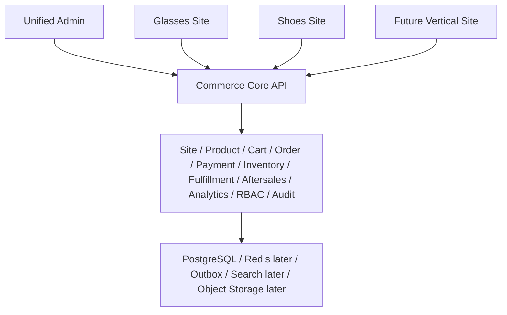

# Cross-border Commerce OS Architecture

本文档用于维护跨境电商自研 Commerce OS 的架构基线。系统已经不再是纯设计稿，而是进入实现阶段：当前代码基于模块化单体，已经包含多站点基础模型、前台、统一后台、API、PostgreSQL migrations、outbox、订单、支付、库存、履约、售后、分析、权限和审计的 MVP 能力。

后续开发必须以本文档、`CONTEXT.md`、`docs/current-implementation-baseline.md`、`docs/mvp-data-model-and-enums.md`、`docs/technology-decisions.md`、`docs/commerce-os-runbook.md` 和 `skills/cross-border-commerce-os/SKILL.md` 为准。

## 0. 当前实现基线

详细实现事实以 `docs/current-implementation-baseline.md` 为准。本节只保留架构层摘要。

当前代码结构：

```text
apps/
  storefront/
  admin/
  api/

packages/
  shared/
  database/
  config/

scripts/
  require-database-url.mjs
  seed-demo-commerce.mjs
```

当前已实现模块：

```text
API modules:
- site
- product
- cart
- order
- payment
- inventory
- fulfillment
- aftersales
- analytics
- operations
- admin-access
- admin-audit
- health

Frontend:
- apps/storefront 已包含首页、商品列表、商品详情、购物车、结算、支付结果、订单列表、订单详情和 Account Lite，已能按 site context 加载 default site 商品并跑通本地 demo 交易链路

Admin:
- apps/admin 当前为统一后台，已包含 Ant Design 全局壳层、固定侧边栏、真实页面路由、可记忆 Admin Work Tabs、运营总览大屏、站点/垂类/品牌管理页、动态属性、分析、风险运营、履约队列和 pipeline 操作入口
- Admin i18n 基础设施已覆盖全局导航、站点管理、交易运营、风险、分析、RBAC、审计和主要详情页静态 UI 文案；新增后台页面应优先接入 `admin-i18n` message key，短期无法逐项接入的 legacy/server 文案需纳入 `admin-static-localization`，业务数据不通过 UI 兜底层硬翻译
```

当前已经跑通的真实链路：

```text
seed demo data
-> load storefront product
-> add cart item
-> create order
-> lock inventory
-> create payment order
-> receive payment webhook
-> process Commerce Pipeline
-> update order paid
-> deduct inventory
-> create fulfillment order
-> ship
-> deliver
-> final order: completed / paid / delivered
```

当前仍需补齐的页面和能力：

```text
Storefront:
- 售后申请页
- FAQ 和联系客服
- 用户注册/登录和持久化地址簿

Admin:
- 商品管理列表和编辑页
- SKU 管理
- 分类管理
- 库存管理
- 订单管理和订单详情
- 支付记录
- 退款管理
- 发货管理
- 用户管理
- 优惠券管理
- 客服工单
- 管理员账号、角色权限、操作日志

Backend:
- 用户认证尚未完整产品化
- 复杂营销、客服、CRM 深度画像和 BI 大屏仍待后续阶段
- 前台真实支付跳转仍是本地 demo/smoke 级别
```

## 0.1 多站点目标架构



演进原则：

```text
- 当前 storefront 作为 default site 继续兼容
- 不复制多个前台项目
- 同一套 storefront 通过 domain resolve 支持多个 site
- 后台通过站点切换器和 admin scope 管理多站点数据
- 后续 PIM、OMS、CRM、WMS、客服、BI 可独立替换或拆分
```

## 1. 设计目标

### 1.1 核心原则

- 业务优先，不做过度设计。
- 先支持 MVP 交易闭环，再逐步扩展。
- 架构采用模块化单体优先，后期可拆服务。
- 订单、支付、库存必须使用状态机设计。
- 支付回调、下单、库存扣减必须支持幂等。
- 系统必须保留事件日志，方便后期对账、追踪、风控。
- 所有关键业务动作必须可审计。
- 前后台解耦，API First。
- 后期可演进为 composable commerce，PIM、OMS、CRM、WMS、客服、BI 可独立替换或拆分。

### 1.2 推荐技术栈

```text
Frontend:
- Next.js
- React
- TypeScript
- Tailwind CSS

Admin:
- React / Next.js Admin
- Ant Design 5，限定在 apps/admin

Backend:
- Node.js
- NestJS
- TypeScript

Database:
- PostgreSQL
- Redis
- Elasticsearch / OpenSearch

Async:
- MVP: PostgreSQL outbox pattern
- Later: RabbitMQ or Kafka

Object Storage:
- S3 / Cloudflare R2 / 阿里云 OSS

Deployment:
- Docker
- Nginx
- GitHub Actions
- 云服务器
- Kubernetes 后期再考虑
```

### 1.3 外部支付设计参考

支付设计遵循支付平台通用原则，并参考 Stripe 官方文档：

- Stripe `POST` 请求支持 idempotency key，用于安全重试，避免重复创建或重复更新资源。
- Stripe webhook 需要用 raw body 和签名头校验签名。
- webhook 可能重复投递，系统应记录并跳过已处理事件。
- webhook 事件不保证按产生顺序投递，业务处理不能依赖事件顺序。

参考：

```text
https://docs.stripe.com/api/idempotent_requests
https://docs.stripe.com/webhooks
```

## 2. 总体架构图

```mermaid
flowchart TB
  subgraph Client["客户端"]
    Storefront["Next.js Storefront"]
    AdminWeb["Next.js Admin"]
  end

  subgraph Edge["接入层"]
    CDN["CDN / WAF"]
    Nginx["Nginx"]
    Api["NestJS API First"]
  end

  subgraph CommerceOS["模块化单体 Commerce OS"]
    User["User/Auth"]
    Product["Product / PIM Lite"]
    Cart["Cart"]
    Order["Order / OMS Core"]
    Payment["Payment"]
    Inventory["Inventory"]
    Fulfillment["Fulfillment / Logistics"]
    Aftersales["After-sales / Refund"]
    CS["Customer Service"]
    CRM["CRM"]
    Marketing["Marketing"]
    Analytics["Analytics"]
    Admin["Admin / RBAC"]
    Audit["Audit / Event Log"]
    Jobs["Jobs / Workers"]
  end

  subgraph Storage["基础设施"]
    PG["PostgreSQL"]
    Redis["Redis"]
    Search["OpenSearch / Elasticsearch"]
    S3["S3 / R2 / OSS"]
    Outbox["PostgreSQL Outbox"]
  end

  subgraph External["外部系统"]
    Stripe["Stripe"]
    PayPal["PayPal"]
    LogisticsProvider["Logistics Provider"]
    EmailSMS["Email / SMS"]
  end

  Storefront --> CDN --> Nginx --> Api
  AdminWeb --> CDN --> Nginx --> Api

  Api --> User
  Api --> Product
  Api --> Cart
  Api --> Order
  Api --> Payment
  Api --> Inventory
  Api --> Fulfillment
  Api --> Aftersales
  Api --> CS
  Api --> CRM
  Api --> Marketing
  Api --> Analytics
  Api --> Admin
  Api --> Audit

  User --> PG
  Product --> PG
  Cart --> Redis
  Cart --> PG
  Order --> PG
  Payment --> PG
  Inventory --> PG
  Fulfillment --> PG
  Aftersales --> PG
  Admin --> PG
  Audit --> PG

  Product --> Search
  Order --> Search
  CS --> Search
  Product --> S3
  Aftersales --> S3

  Order --> Outbox
  Payment --> Outbox
  Inventory --> Outbox
  Fulfillment --> Outbox
  Aftersales --> Outbox
  Outbox --> Jobs

  Payment --> Stripe
  Payment --> PayPal
  Fulfillment --> LogisticsProvider
  Marketing --> EmailSMS
```



## 3. 模块边界

### 3.1 User Module

职责：

- 用户注册、登录、OAuth、游客用户。
- 用户地址、多国家/地区、多语言偏好、多币种偏好。
- 用户标签、黑名单、风控标记。
- 用户登录日志、设备记录。

拥有数据：

```text
users
user_profiles
user_addresses
user_devices
user_risk_tags
user_login_logs
```

边界规则：

- 不负责后台管理员权限。
- 不直接修改订单、支付、库存状态。
- 只向订单、CRM、风控提供用户身份和用户画像基础信息。

### 3.2 Product Module

职责：

- SPU、SKU、分类、属性、变体、图片。
- 多语言标题/描述。
- 多币种价格。
- 商品上下架、SEO 信息、商品标签、区域售卖限制。

拥有数据：

```text
products
product_skus
product_categories
product_attributes
product_attribute_values
product_media
product_translations
sku_prices
sku_region_rules
```

边界规则：

- Product 提供商品可售性、价格、区域规则。
- 订单必须保存商品快照，不能只引用 Product 当前数据。
- Product 不负责库存余额，只引用 SKU 维度。

### 3.3 Cart Module

职责：

- 游客购物车、登录用户购物车。
- SKU 数量校验、价格展示、优惠预计算、运费预估、库存预校验。

拥有数据：

```text
carts
cart_items
```

边界规则：

- 购物车价格只用于展示。
- 最终价格以下单时订单快照为准。
- 购物车不锁库存。

### 3.4 Order Module

职责：

- 创建订单、主订单、子订单、订单商品快照。
- 订单状态机、支付状态、发货状态、售后状态。
- 订单取消、超时关闭、部分退款、全额退款、拒付记录引用。
- 订单日志和订单事件。

拥有数据：

```text
orders
order_items
order_payments
order_fulfillments
order_refunds
order_status_logs
order_events
```

边界规则：

- 订单模块不直接调用 Stripe/PayPal。
- 订单模块不直接扣减库存，只发起锁库存请求或消费库存事件。
- 支付成功不能信任前端，只能由 PaymentSucceeded 事件推进。
- 订单状态、支付状态、履约状态、售后状态必须分列。
- 所有状态变更必须写 `order_status_logs` 和审计日志。

### 3.5 Payment Module

职责：

- 支付渠道、支付单、支付交易、支付回调。
- 支付重试、退款、部分退款、拒付、对账。
- 支付路由预留。

拥有数据：

```text
payment_channels
payment_orders
payment_transactions
payment_webhook_events
payment_refunds
payment_chargebacks
```

边界规则：

- 所有支付 POST 请求必须使用 idempotency key。
- webhook event_id 必须唯一入库。
- webhook 先验签、落库，再异步处理业务。
- 重复 webhook 不允许重复改订单、重复扣库存、重复发货。
- 支付成功后通过事件驱动订单状态变更。

### 3.6 Inventory Module

职责：

- 可售库存、锁定库存、实际库存、在途库存、安全库存。
- 多仓库数据模型。
- 库存锁定、库存释放、正式扣减、库存流水。

拥有数据：

```text
warehouses
sku_inventory
inventory_locks
inventory_transactions
```

边界规则：

- 下单锁库存。
- 支付成功正式扣库存。
- 支付超时和订单取消释放库存。
- 退款不一定自动回库存，需要按售后和仓库收货结果处理。
- Redis 锁只作为辅助，PostgreSQL 行锁和唯一约束才是正确性基础。

### 3.7 Fulfillment Module

职责：

- 仓库管理、发货单、物流商、运单号、物流轨迹。
- 多仓拆单预留、面单预留、签收状态、异常件。

拥有数据：

```text
fulfillment_orders
fulfillment_items
logistics_providers
shipments
shipment_tracking_events
```

边界规则：

- 未支付订单不能创建发货单。
- 发货状态只更新 fulfillment_status，不直接更新 payment_status。
- 部分发货必须支持 `partially_shipped`。

### 3.8 After-sales Module

职责：

- 退款申请、退货申请、换货申请。
- 仅退款、退货退款、售后审核、售后凭证、售后日志。

拥有数据：

```text
after_sales_requests
after_sales_items
after_sales_logs
after_sales_attachments
```

边界规则：

- 售后模块负责审核和流程。
- 支付退款动作由 Payment Module 执行。
- 库存回补由售后结果和仓库收货结果驱动，不默认自动回补。

### 3.9 Customer Service Module

职责：

- 在线客服、邮件工单、订单关联、用户关联。
- 消息记录、客服备注、SLA、超时提醒、FAQ、AI 客服预留。

拥有数据：

```text
conversations
conversation_messages
tickets
ticket_logs
agent_users
agent_status_logs
customer_service_sla_rules
```

边界规则：

- 客服可以查看订单上下文，但不能绕过订单、退款、权限流程直接改核心状态。

### 3.10 CRM Module

职责：

- 用户画像、RFM 分层、复购统计、用户标签、会员等级。
- 积分、优惠券归属、用户生命周期、黑名单、营销触达记录。

拥有数据：

```text
customer_profiles
customer_tags
customer_segments
customer_points
customer_coupons
customer_marketing_events
```

边界规则：

- CRM 消费订单、支付、退款、客服事件。
- CRM 不直接驱动订单状态。

### 3.11 Marketing Module

职责：

- 优惠券、满减、折扣码、新人券、弃单召回。
- 邮件营销、短信营销、会员营销、活动页。

拥有数据：

```text
coupons
promotion_rules
promotion_campaigns
abandoned_checkouts
marketing_messages
marketing_send_logs
```

边界规则：

- MVP 只做优惠券基础能力。
- 优惠计算结果必须进入订单快照。
- 优惠券核销必须幂等。

### 3.12 Analytics Module

职责：

- GMV、净销售额、毛利、订单数、客单价、转化率。
- 退款率、拒付率、复购率、CAC、ROAS、LTV、渠道 ROI。

拥有数据：

```text
analytics_events
daily_sales_stats
channel_performance_stats
product_performance_stats
customer_ltv_stats
```

边界规则：

- MVP 可先通过事件表和订单表生成日报。
- 后期应从主库读模型迁移到数仓或 OLAP。

### 3.13 Admin / RBAC Module

职责：

- 管理员账号、角色、权限树、菜单权限、操作权限、数据权限。
- 操作审计日志。

拥有数据：

```text
admin_users
admin_roles
admin_permissions
admin_role_permissions
admin_user_roles
admin_operation_logs
```

边界规则：

- 所有后台写操作必须鉴权。
- 高风险动作需要操作审计。
- 退款、库存调整、订单取消、角色授权建议二次确认。

### 3.14 Audit / Event Module

职责：

- 领域事件 outbox。
- 事件处理状态。
- 审计日志。
- 对账和追踪的统一事件底座。

拥有数据：

```text
domain_events
event_process_logs
audit_logs
```

边界规则：

- 审计日志只追加，不物理删除。
- domain_events 用于业务事件流转。
- audit_logs 用于追责和合规，不替代业务流水。

## 4. 数据库 ERD

```mermaid
erDiagram
  users ||--o{ user_addresses : has
  users ||--o{ user_login_logs : logs
  users ||--o{ carts : owns
  users ||--o{ orders : places

  products ||--o{ product_skus : has
  products ||--o{ product_media : has
  products ||--o{ product_translations : has
  product_categories ||--o{ products : groups
  product_skus ||--o{ sku_prices : has
  product_skus ||--o{ sku_region_rules : restricts
  product_skus ||--o{ sku_inventory : stocked

  carts ||--o{ cart_items : contains
  product_skus ||--o{ cart_items : selected

  orders ||--o{ order_items : contains
  orders ||--o{ order_payments : has
  orders ||--o{ order_fulfillments : has
  orders ||--o{ order_refunds : has
  orders ||--o{ order_status_logs : logs
  orders ||--o{ order_events : emits
  product_skus ||--o{ order_items : snapshot_from

  payment_channels ||--o{ payment_orders : supports
  orders ||--o{ payment_orders : pays
  payment_orders ||--o{ payment_transactions : has
  payment_orders ||--o{ payment_webhook_events : receives
  payment_orders ||--o{ payment_refunds : refunds
  payment_orders ||--o{ payment_chargebacks : chargebacks

  warehouses ||--o{ sku_inventory : stores
  sku_inventory ||--o{ inventory_locks : locks
  sku_inventory ||--o{ inventory_transactions : changes
  orders ||--o{ inventory_locks : reserves

  orders ||--o{ fulfillment_orders : creates
  fulfillment_orders ||--o{ fulfillment_items : contains
  fulfillment_orders ||--o{ shipments : ships
  logistics_providers ||--o{ shipments : handles
  shipments ||--o{ shipment_tracking_events : tracks

  orders ||--o{ after_sales_requests : has
  after_sales_requests ||--o{ after_sales_items : contains
  after_sales_requests ||--o{ after_sales_logs : logs
  after_sales_requests ||--o{ after_sales_attachments : attaches

  users ||--o{ conversations : starts
  conversations ||--o{ conversation_messages : contains
  users ||--o{ tickets : creates
  tickets ||--o{ ticket_logs : logs

  users ||--o{ customer_profiles : maps
  customer_profiles ||--o{ customer_tags : has
  customer_profiles ||--o{ customer_points : earns
  customer_profiles ||--o{ customer_coupons : owns

  coupons ||--o{ customer_coupons : assigned
  promotion_campaigns ||--o{ promotion_rules : contains

  admin_users ||--o{ admin_operation_logs : writes
  admin_users ||--o{ admin_user_roles : has
  admin_roles ||--o{ admin_user_roles : assigned
  admin_roles ||--o{ admin_role_permissions : grants
  admin_permissions ||--o{ admin_role_permissions : assigned

  domain_events ||--o{ event_process_logs : processed_by
```



## 5. 核心表结构 SQL 草案

以下 SQL 是核心数据模型草案，用于指导后续 migration，不代表最终索引和约束已经完整。

### 5.1 用户与权限

```sql
CREATE TABLE users (
  id UUID PRIMARY KEY,
  email VARCHAR(255) UNIQUE,
  phone VARCHAR(64) UNIQUE,
  password_hash TEXT,
  status VARCHAR(32) NOT NULL DEFAULT 'active',
  user_type VARCHAR(32) NOT NULL DEFAULT 'registered',
  default_locale VARCHAR(16),
  default_currency CHAR(3),
  risk_level VARCHAR(32) NOT NULL DEFAULT 'normal',
  created_at TIMESTAMPTZ NOT NULL,
  updated_at TIMESTAMPTZ NOT NULL
);

CREATE TABLE user_profiles (
  id UUID PRIMARY KEY,
  user_id UUID NOT NULL UNIQUE REFERENCES users(id),
  first_name VARCHAR(128),
  last_name VARCHAR(128),
  birthday DATE,
  country_code VARCHAR(8),
  metadata JSONB NOT NULL DEFAULT '{}',
  created_at TIMESTAMPTZ NOT NULL,
  updated_at TIMESTAMPTZ NOT NULL
);

CREATE TABLE user_addresses (
  id UUID PRIMARY KEY,
  user_id UUID NOT NULL REFERENCES users(id),
  country_code VARCHAR(8) NOT NULL,
  province VARCHAR(128),
  city VARCHAR(128),
  postal_code VARCHAR(64),
  address_line1 TEXT NOT NULL,
  address_line2 TEXT,
  recipient_name VARCHAR(255) NOT NULL,
  recipient_phone VARCHAR(64),
  is_default BOOLEAN NOT NULL DEFAULT FALSE,
  created_at TIMESTAMPTZ NOT NULL,
  updated_at TIMESTAMPTZ NOT NULL
);

CREATE TABLE user_login_logs (
  id UUID PRIMARY KEY,
  user_id UUID REFERENCES users(id),
  login_type VARCHAR(32) NOT NULL,
  ip_address VARCHAR(64),
  user_agent TEXT,
  success BOOLEAN NOT NULL,
  failure_reason TEXT,
  created_at TIMESTAMPTZ NOT NULL
);

CREATE TABLE admin_users (
  id UUID PRIMARY KEY,
  email VARCHAR(255) NOT NULL UNIQUE,
  password_hash TEXT NOT NULL,
  display_name VARCHAR(128) NOT NULL,
  status VARCHAR(32) NOT NULL DEFAULT 'active',
  last_login_at TIMESTAMPTZ,
  created_at TIMESTAMPTZ NOT NULL,
  updated_at TIMESTAMPTZ NOT NULL
);

CREATE TABLE admin_roles (
  id UUID PRIMARY KEY,
  code VARCHAR(64) NOT NULL UNIQUE,
  name VARCHAR(128) NOT NULL,
  description TEXT,
  created_at TIMESTAMPTZ NOT NULL,
  updated_at TIMESTAMPTZ NOT NULL
);

CREATE TABLE admin_permissions (
  id UUID PRIMARY KEY,
  code VARCHAR(128) NOT NULL UNIQUE,
  name VARCHAR(128) NOT NULL,
  type VARCHAR(32) NOT NULL,
  resource VARCHAR(128) NOT NULL,
  action VARCHAR(64) NOT NULL,
  parent_id UUID REFERENCES admin_permissions(id),
  created_at TIMESTAMPTZ NOT NULL
);

CREATE TABLE admin_user_roles (
  admin_user_id UUID NOT NULL REFERENCES admin_users(id),
  role_id UUID NOT NULL REFERENCES admin_roles(id),
  PRIMARY KEY (admin_user_id, role_id)
);

CREATE TABLE admin_role_permissions (
  role_id UUID NOT NULL REFERENCES admin_roles(id),
  permission_id UUID NOT NULL REFERENCES admin_permissions(id),
  PRIMARY KEY (role_id, permission_id)
);
```

### 5.2 商品、SKU、价格

```sql
CREATE TABLE product_categories (
  id UUID PRIMARY KEY,
  parent_id UUID REFERENCES product_categories(id),
  slug VARCHAR(255) NOT NULL UNIQUE,
  name VARCHAR(255) NOT NULL,
  sort_order INT NOT NULL DEFAULT 0,
  is_active BOOLEAN NOT NULL DEFAULT TRUE,
  created_at TIMESTAMPTZ NOT NULL,
  updated_at TIMESTAMPTZ NOT NULL
);

CREATE TABLE products (
  id UUID PRIMARY KEY,
  category_id UUID REFERENCES product_categories(id),
  spu_code VARCHAR(128) NOT NULL UNIQUE,
  slug VARCHAR(255) NOT NULL UNIQUE,
  title VARCHAR(255) NOT NULL,
  description TEXT,
  status VARCHAR(32) NOT NULL DEFAULT 'draft',
  seo_title VARCHAR(255),
  seo_description TEXT,
  tags TEXT[] NOT NULL DEFAULT '{}',
  published_at TIMESTAMPTZ,
  created_at TIMESTAMPTZ NOT NULL,
  updated_at TIMESTAMPTZ NOT NULL
);

CREATE TABLE product_skus (
  id UUID PRIMARY KEY,
  product_id UUID NOT NULL REFERENCES products(id),
  sku_code VARCHAR(128) NOT NULL UNIQUE,
  title VARCHAR(255),
  attributes JSONB NOT NULL DEFAULT '{}',
  weight_gram INT,
  length_mm INT,
  width_mm INT,
  height_mm INT,
  status VARCHAR(32) NOT NULL DEFAULT 'active',
  created_at TIMESTAMPTZ NOT NULL,
  updated_at TIMESTAMPTZ NOT NULL
);

CREATE TABLE product_media (
  id UUID PRIMARY KEY,
  product_id UUID NOT NULL REFERENCES products(id),
  sku_id UUID REFERENCES product_skus(id),
  media_type VARCHAR(32) NOT NULL,
  url TEXT NOT NULL,
  alt_text VARCHAR(255),
  sort_order INT NOT NULL DEFAULT 0,
  created_at TIMESTAMPTZ NOT NULL
);

CREATE TABLE product_translations (
  id UUID PRIMARY KEY,
  product_id UUID NOT NULL REFERENCES products(id),
  locale VARCHAR(16) NOT NULL,
  title VARCHAR(255) NOT NULL,
  description TEXT,
  seo_title VARCHAR(255),
  seo_description TEXT,
  UNIQUE (product_id, locale)
);

CREATE TABLE sku_prices (
  id UUID PRIMARY KEY,
  sku_id UUID NOT NULL REFERENCES product_skus(id),
  currency CHAR(3) NOT NULL,
  region_code VARCHAR(16),
  list_price NUMERIC(18,2) NOT NULL,
  sale_price NUMERIC(18,2),
  starts_at TIMESTAMPTZ,
  ends_at TIMESTAMPTZ,
  created_at TIMESTAMPTZ NOT NULL,
  UNIQUE (sku_id, currency, region_code)
);

CREATE TABLE sku_region_rules (
  id UUID PRIMARY KEY,
  sku_id UUID NOT NULL REFERENCES product_skus(id),
  region_code VARCHAR(16) NOT NULL,
  is_sellable BOOLEAN NOT NULL DEFAULT TRUE,
  reason TEXT,
  created_at TIMESTAMPTZ NOT NULL,
  UNIQUE (sku_id, region_code)
);
```

### 5.3 购物车

```sql
CREATE TABLE carts (
  id UUID PRIMARY KEY,
  user_id UUID REFERENCES users(id),
  guest_token VARCHAR(128),
  currency CHAR(3) NOT NULL,
  country_code VARCHAR(8),
  status VARCHAR(32) NOT NULL DEFAULT 'active',
  created_at TIMESTAMPTZ NOT NULL,
  updated_at TIMESTAMPTZ NOT NULL
);

CREATE TABLE cart_items (
  id UUID PRIMARY KEY,
  cart_id UUID NOT NULL REFERENCES carts(id),
  sku_id UUID NOT NULL REFERENCES product_skus(id),
  quantity INT NOT NULL,
  display_unit_price NUMERIC(18,2) NOT NULL,
  display_currency CHAR(3) NOT NULL,
  selected BOOLEAN NOT NULL DEFAULT TRUE,
  created_at TIMESTAMPTZ NOT NULL,
  updated_at TIMESTAMPTZ NOT NULL,
  UNIQUE (cart_id, sku_id)
);
```

### 5.4 订单

```sql
CREATE TABLE orders (
  id UUID PRIMARY KEY,
  order_no VARCHAR(64) NOT NULL UNIQUE,
  user_id UUID REFERENCES users(id),
  guest_token VARCHAR(128),
  order_status VARCHAR(32) NOT NULL,
  payment_status VARCHAR(32) NOT NULL,
  fulfillment_status VARCHAR(32) NOT NULL,
  aftersales_status VARCHAR(32) NOT NULL DEFAULT 'none',
  currency CHAR(3) NOT NULL,
  subtotal_amount NUMERIC(18,2) NOT NULL,
  discount_amount NUMERIC(18,2) NOT NULL DEFAULT 0,
  shipping_amount NUMERIC(18,2) NOT NULL DEFAULT 0,
  tax_amount NUMERIC(18,2) NOT NULL DEFAULT 0,
  total_amount NUMERIC(18,2) NOT NULL,
  country_code VARCHAR(8),
  shipping_address_snapshot JSONB NOT NULL,
  billing_address_snapshot JSONB,
  price_snapshot JSONB NOT NULL,
  idempotency_key VARCHAR(128) NOT NULL,
  created_at TIMESTAMPTZ NOT NULL,
  updated_at TIMESTAMPTZ NOT NULL,
  paid_at TIMESTAMPTZ,
  cancelled_at TIMESTAMPTZ,
  closed_at TIMESTAMPTZ,
  UNIQUE (user_id, idempotency_key)
);

CREATE TABLE order_items (
  id UUID PRIMARY KEY,
  order_id UUID NOT NULL REFERENCES orders(id),
  product_id UUID NOT NULL REFERENCES products(id),
  sku_id UUID NOT NULL REFERENCES product_skus(id),
  sku_code VARCHAR(128) NOT NULL,
  product_title TEXT NOT NULL,
  sku_title TEXT,
  image_url TEXT,
  unit_price NUMERIC(18,2) NOT NULL,
  quantity INT NOT NULL,
  discount_amount NUMERIC(18,2) NOT NULL DEFAULT 0,
  total_amount NUMERIC(18,2) NOT NULL,
  snapshot JSONB NOT NULL,
  created_at TIMESTAMPTZ NOT NULL
);

CREATE TABLE order_status_logs (
  id UUID PRIMARY KEY,
  order_id UUID NOT NULL REFERENCES orders(id),
  status_type VARCHAR(32) NOT NULL,
  from_status VARCHAR(32),
  to_status VARCHAR(32) NOT NULL,
  reason TEXT,
  operator_type VARCHAR(32) NOT NULL,
  operator_id UUID,
  metadata JSONB NOT NULL DEFAULT '{}',
  created_at TIMESTAMPTZ NOT NULL
);

CREATE TABLE order_events (
  id UUID PRIMARY KEY,
  order_id UUID NOT NULL REFERENCES orders(id),
  event_type VARCHAR(128) NOT NULL,
  payload JSONB NOT NULL,
  created_at TIMESTAMPTZ NOT NULL
);
```

### 5.5 支付、退款、拒付

```sql
CREATE TABLE payment_channels (
  id UUID PRIMARY KEY,
  channel_code VARCHAR(32) NOT NULL UNIQUE,
  name VARCHAR(128) NOT NULL,
  status VARCHAR(32) NOT NULL DEFAULT 'active',
  config JSONB NOT NULL DEFAULT '{}',
  created_at TIMESTAMPTZ NOT NULL,
  updated_at TIMESTAMPTZ NOT NULL
);

CREATE TABLE payment_orders (
  id UUID PRIMARY KEY,
  order_id UUID NOT NULL REFERENCES orders(id),
  payment_no VARCHAR(64) NOT NULL UNIQUE,
  channel_code VARCHAR(32) NOT NULL,
  status VARCHAR(32) NOT NULL,
  amount NUMERIC(18,2) NOT NULL,
  currency CHAR(3) NOT NULL,
  provider_payment_id VARCHAR(128),
  idempotency_key VARCHAR(128) NOT NULL UNIQUE,
  request_payload JSONB,
  response_payload JSONB,
  created_at TIMESTAMPTZ NOT NULL,
  updated_at TIMESTAMPTZ NOT NULL,
  succeeded_at TIMESTAMPTZ,
  failed_at TIMESTAMPTZ
);

CREATE TABLE payment_transactions (
  id UUID PRIMARY KEY,
  payment_order_id UUID NOT NULL REFERENCES payment_orders(id),
  channel_code VARCHAR(32) NOT NULL,
  provider_transaction_id VARCHAR(128) NOT NULL,
  transaction_type VARCHAR(32) NOT NULL,
  status VARCHAR(32) NOT NULL,
  amount NUMERIC(18,2) NOT NULL,
  currency CHAR(3) NOT NULL,
  raw_payload JSONB NOT NULL,
  created_at TIMESTAMPTZ NOT NULL,
  UNIQUE (channel_code, provider_transaction_id)
);

CREATE TABLE payment_webhook_events (
  id UUID PRIMARY KEY,
  payment_order_id UUID REFERENCES payment_orders(id),
  channel_code VARCHAR(32) NOT NULL,
  provider_event_id VARCHAR(128) NOT NULL,
  event_type VARCHAR(128) NOT NULL,
  provider_object_id VARCHAR(128),
  raw_payload JSONB NOT NULL,
  signature_header TEXT,
  status VARCHAR(32) NOT NULL,
  error_message TEXT,
  received_at TIMESTAMPTZ NOT NULL,
  processed_at TIMESTAMPTZ,
  UNIQUE (channel_code, provider_event_id)
);

CREATE TABLE payment_refunds (
  id UUID PRIMARY KEY,
  payment_order_id UUID NOT NULL REFERENCES payment_orders(id),
  order_id UUID NOT NULL REFERENCES orders(id),
  refund_no VARCHAR(64) NOT NULL UNIQUE,
  provider_refund_id VARCHAR(128),
  status VARCHAR(32) NOT NULL,
  amount NUMERIC(18,2) NOT NULL,
  currency CHAR(3) NOT NULL,
  reason TEXT,
  idempotency_key VARCHAR(128) NOT NULL UNIQUE,
  request_payload JSONB,
  response_payload JSONB,
  created_at TIMESTAMPTZ NOT NULL,
  succeeded_at TIMESTAMPTZ,
  failed_at TIMESTAMPTZ
);

CREATE TABLE payment_chargebacks (
  id UUID PRIMARY KEY,
  payment_order_id UUID NOT NULL REFERENCES payment_orders(id),
  order_id UUID NOT NULL REFERENCES orders(id),
  provider_dispute_id VARCHAR(128) NOT NULL,
  status VARCHAR(32) NOT NULL,
  amount NUMERIC(18,2) NOT NULL,
  currency CHAR(3) NOT NULL,
  reason TEXT,
  raw_payload JSONB NOT NULL,
  created_at TIMESTAMPTZ NOT NULL,
  updated_at TIMESTAMPTZ NOT NULL,
  UNIQUE (provider_dispute_id)
);
```

### 5.6 库存

```sql
CREATE TABLE warehouses (
  id UUID PRIMARY KEY,
  code VARCHAR(64) NOT NULL UNIQUE,
  name VARCHAR(128) NOT NULL,
  country_code VARCHAR(8) NOT NULL,
  status VARCHAR(32) NOT NULL DEFAULT 'active',
  created_at TIMESTAMPTZ NOT NULL,
  updated_at TIMESTAMPTZ NOT NULL
);

CREATE TABLE sku_inventory (
  id UUID PRIMARY KEY,
  sku_id UUID NOT NULL REFERENCES product_skus(id),
  warehouse_id UUID NOT NULL REFERENCES warehouses(id),
  available_qty INT NOT NULL DEFAULT 0,
  locked_qty INT NOT NULL DEFAULT 0,
  physical_qty INT NOT NULL DEFAULT 0,
  inbound_qty INT NOT NULL DEFAULT 0,
  safety_qty INT NOT NULL DEFAULT 0,
  version INT NOT NULL DEFAULT 0,
  updated_at TIMESTAMPTZ NOT NULL,
  UNIQUE (sku_id, warehouse_id),
  CHECK (available_qty >= 0),
  CHECK (locked_qty >= 0),
  CHECK (physical_qty >= 0),
  CHECK (inbound_qty >= 0),
  CHECK (safety_qty >= 0)
);

CREATE TABLE inventory_locks (
  id UUID PRIMARY KEY,
  order_id UUID NOT NULL REFERENCES orders(id),
  order_item_id UUID NOT NULL REFERENCES order_items(id),
  sku_id UUID NOT NULL REFERENCES product_skus(id),
  warehouse_id UUID NOT NULL REFERENCES warehouses(id),
  quantity INT NOT NULL,
  status VARCHAR(32) NOT NULL,
  expires_at TIMESTAMPTZ NOT NULL,
  released_at TIMESTAMPTZ,
  deducted_at TIMESTAMPTZ,
  idempotency_key VARCHAR(128) NOT NULL UNIQUE,
  created_at TIMESTAMPTZ NOT NULL
);

CREATE TABLE inventory_transactions (
  id UUID PRIMARY KEY,
  sku_id UUID NOT NULL REFERENCES product_skus(id),
  warehouse_id UUID NOT NULL REFERENCES warehouses(id),
  order_id UUID REFERENCES orders(id),
  type VARCHAR(32) NOT NULL,
  quantity INT NOT NULL,
  before_available INT NOT NULL,
  after_available INT NOT NULL,
  before_locked INT NOT NULL,
  after_locked INT NOT NULL,
  before_physical INT NOT NULL,
  after_physical INT NOT NULL,
  idempotency_key VARCHAR(128) NOT NULL UNIQUE,
  created_at TIMESTAMPTZ NOT NULL
);
```

### 5.7 履约与售后

```sql
CREATE TABLE fulfillment_orders (
  id UUID PRIMARY KEY,
  order_id UUID NOT NULL REFERENCES orders(id),
  fulfillment_no VARCHAR(64) NOT NULL UNIQUE,
  warehouse_id UUID REFERENCES warehouses(id),
  status VARCHAR(32) NOT NULL,
  created_at TIMESTAMPTZ NOT NULL,
  updated_at TIMESTAMPTZ NOT NULL
);

CREATE TABLE fulfillment_items (
  id UUID PRIMARY KEY,
  fulfillment_order_id UUID NOT NULL REFERENCES fulfillment_orders(id),
  order_item_id UUID NOT NULL REFERENCES order_items(id),
  sku_id UUID NOT NULL REFERENCES product_skus(id),
  quantity INT NOT NULL,
  created_at TIMESTAMPTZ NOT NULL
);

CREATE TABLE logistics_providers (
  id UUID PRIMARY KEY,
  code VARCHAR(64) NOT NULL UNIQUE,
  name VARCHAR(128) NOT NULL,
  status VARCHAR(32) NOT NULL DEFAULT 'active',
  config JSONB NOT NULL DEFAULT '{}',
  created_at TIMESTAMPTZ NOT NULL,
  updated_at TIMESTAMPTZ NOT NULL
);

CREATE TABLE shipments (
  id UUID PRIMARY KEY,
  fulfillment_order_id UUID NOT NULL REFERENCES fulfillment_orders(id),
  provider_id UUID NOT NULL REFERENCES logistics_providers(id),
  tracking_no VARCHAR(128) NOT NULL,
  status VARCHAR(32) NOT NULL,
  shipped_at TIMESTAMPTZ,
  delivered_at TIMESTAMPTZ,
  created_at TIMESTAMPTZ NOT NULL,
  updated_at TIMESTAMPTZ NOT NULL,
  UNIQUE (provider_id, tracking_no)
);

CREATE TABLE shipment_tracking_events (
  id UUID PRIMARY KEY,
  shipment_id UUID NOT NULL REFERENCES shipments(id),
  tracking_status VARCHAR(64) NOT NULL,
  description TEXT,
  location TEXT,
  occurred_at TIMESTAMPTZ NOT NULL,
  raw_payload JSONB,
  created_at TIMESTAMPTZ NOT NULL
);

CREATE TABLE after_sales_requests (
  id UUID PRIMARY KEY,
  order_id UUID NOT NULL REFERENCES orders(id),
  user_id UUID REFERENCES users(id),
  request_no VARCHAR(64) NOT NULL UNIQUE,
  type VARCHAR(32) NOT NULL,
  status VARCHAR(32) NOT NULL,
  reason TEXT NOT NULL,
  requested_amount NUMERIC(18,2),
  approved_amount NUMERIC(18,2),
  created_at TIMESTAMPTZ NOT NULL,
  updated_at TIMESTAMPTZ NOT NULL
);

CREATE TABLE after_sales_items (
  id UUID PRIMARY KEY,
  after_sales_request_id UUID NOT NULL REFERENCES after_sales_requests(id),
  order_item_id UUID NOT NULL REFERENCES order_items(id),
  quantity INT NOT NULL,
  requested_amount NUMERIC(18,2),
  approved_amount NUMERIC(18,2),
  created_at TIMESTAMPTZ NOT NULL
);

CREATE TABLE after_sales_logs (
  id UUID PRIMARY KEY,
  after_sales_request_id UUID NOT NULL REFERENCES after_sales_requests(id),
  action VARCHAR(64) NOT NULL,
  from_status VARCHAR(32),
  to_status VARCHAR(32),
  operator_type VARCHAR(32) NOT NULL,
  operator_id UUID,
  note TEXT,
  created_at TIMESTAMPTZ NOT NULL
);
```

### 5.8 事件与审计

```sql
CREATE TABLE domain_events (
  id UUID PRIMARY KEY,
  event_type VARCHAR(128) NOT NULL,
  aggregate_type VARCHAR(64) NOT NULL,
  aggregate_id UUID NOT NULL,
  payload JSONB NOT NULL,
  status VARCHAR(32) NOT NULL DEFAULT 'pending',
  retry_count INT NOT NULL DEFAULT 0,
  next_retry_at TIMESTAMPTZ,
  created_at TIMESTAMPTZ NOT NULL,
  processed_at TIMESTAMPTZ,
  UNIQUE (event_type, aggregate_id, id)
);

CREATE TABLE event_process_logs (
  id UUID PRIMARY KEY,
  event_id UUID NOT NULL REFERENCES domain_events(id),
  consumer_name VARCHAR(128) NOT NULL,
  status VARCHAR(32) NOT NULL,
  error_message TEXT,
  created_at TIMESTAMPTZ NOT NULL,
  UNIQUE (event_id, consumer_name)
);

CREATE TABLE audit_logs (
  id UUID PRIMARY KEY,
  actor_type VARCHAR(32) NOT NULL,
  actor_id UUID,
  action VARCHAR(128) NOT NULL,
  resource_type VARCHAR(64) NOT NULL,
  resource_id VARCHAR(128),
  before_snapshot JSONB,
  after_snapshot JSONB,
  ip_address VARCHAR(64),
  user_agent TEXT,
  request_id VARCHAR(128),
  created_at TIMESTAMPTZ NOT NULL
);

CREATE TABLE admin_operation_logs (
  id UUID PRIMARY KEY,
  admin_user_id UUID NOT NULL REFERENCES admin_users(id),
  action VARCHAR(128) NOT NULL,
  resource_type VARCHAR(64) NOT NULL,
  resource_id VARCHAR(128),
  before_snapshot JSONB,
  after_snapshot JSONB,
  ip_address VARCHAR(64),
  user_agent TEXT,
  request_id VARCHAR(128),
  created_at TIMESTAMPTZ NOT NULL
);
```

## 6. 状态机设计

### 6.1 订单状态

```text
pending_payment
  -> payment_processing
  -> paid
  -> confirmed
  -> partially_fulfilled
  -> fulfilled
  -> completed

pending_payment
  -> cancelled
  -> closed

payment_processing
  -> paid
  -> cancelled
  -> closed

paid
  -> confirmed
  -> cancelled

confirmed
  -> partially_fulfilled
  -> fulfilled

partially_fulfilled
  -> fulfilled

fulfilled
  -> completed
```

约束：

```text
- pending_payment 只能由 CreateOrder 创建。
- payment_processing 只能由 CreatePayment 或支付跳转前置动作触发。
- paid 只能由 PaymentSucceeded 事件触发。
- confirmed 可由后台确认或自动确认触发。
- partially_fulfilled / fulfilled 只能由 Fulfillment 模块触发。
- completed 可由签收后自动任务或后台确认触发。
- cancelled 只能发生在未发货或业务允许取消阶段。
- closed 表示最终不可再推进。
```

### 6.2 支付状态

```text
unpaid
  -> processing
  -> paid

processing
  -> failed
  -> paid

paid
  -> partially_refunded
  -> refunded
  -> chargeback
```

约束：

```text
- paid 只能由支付渠道确认后的事件触发。
- partially_refunded 和 refunded 只能由 RefundSucceeded 事件触发。
- chargeback 只能由支付渠道拒付事件或人工录入拒付确认触发。
```

### 6.3 履约状态

```text
unfulfilled
  -> pending
  -> shipped
  -> delivered

pending
  -> partially_shipped
  -> shipped

shipped
  -> delivered

pending
  -> failed
```

约束：

```text
- 未支付订单不能进入 pending fulfillment。
- 部分发货必须使用 partially_shipped。
- delivered 不代表订单一定 completed，可配置自动完成周期。
```

### 6.4 售后状态

```text
none
  -> requested
  -> reviewing
  -> approved
  -> refunding
  -> completed

reviewing
  -> rejected
  -> closed

approved
  -> returning
  -> received
  -> refunding
```

约束：

```text
- 仅退款可从 approved 直接进入 refunding。
- 退货退款必须根据策略决定是否需要 returning 和 received。
- 库存回补必须由 received 或人工确认触发。
```

## 7. 支付回调幂等设计

### 7.1 webhook 处理流程

```text
1. 接收支付渠道 webhook。
2. 使用 raw body + signature header 验签。
3. 提取 provider_event_id、event_type、provider_object_id。
4. 插入 payment_webhook_events。
5. 如果唯一键冲突，说明事件已接收，直接返回 200。
6. 新事件落库后尽快返回 2xx。
7. worker 异步读取 status = received 的事件。
8. 根据 provider_object_id 查询 payment_order。
9. 使用 payment_transactions 唯一键保证交易不重复入账。
10. 更新 payment_order 状态。
11. 写 domain_events，例如 PaymentSucceeded。
12. 标记 webhook processed。
13. 下游 Order、Inventory、CRM、Marketing 分别消费事件。
```

### 7.2 幂等边界

```text
支付请求：
- payment_orders.idempotency_key 唯一。
- 外部支付 POST 请求使用同一个 provider idempotency key。

webhook 接收：
- payment_webhook_events(channel_code, provider_event_id) 唯一。

交易入账：
- payment_transactions(channel_code, provider_transaction_id) 唯一。

退款：
- payment_refunds.idempotency_key 唯一。
- provider_refund_id 唯一或在 channel_code 维度唯一。

领域事件：
- event_process_logs(event_id, consumer_name) 唯一。
```

### 7.3 失败重试

```text
- webhook 已落库但处理失败，status = failed。
- worker 根据 retry_count 和 next_retry_at 重试。
- 超过阈值进入 dead_letter 状态。
- 后台提供 webhook 事件重放入口，但重放仍走同一套幂等逻辑。
```

## 8. 库存锁定与释放设计

### 8.1 下单锁库存

```text
1. 创建订单前完成价格快照。
2. 对每个 sku_inventory 执行 SELECT FOR UPDATE。
3. 校验 available_qty - safety_qty >= purchase_qty。
4. available_qty -= purchase_qty。
5. locked_qty += purchase_qty。
6. 创建 inventory_locks，status = locked。
7. 创建 inventory_transactions，type = lock。
8. 写 InventoryLocked 事件。
```

### 8.2 支付成功扣库存

```text
1. 消费 PaymentSucceeded 或 OrderPaid 事件。
2. 查询 order_id 下所有 locked 状态 inventory_locks。
3. 对 sku_inventory 执行 SELECT FOR UPDATE。
4. locked_qty -= quantity。
5. physical_qty -= quantity。
6. inventory_locks.status = deducted。
7. 创建 inventory_transactions，type = deduct。
8. 写 InventoryDeducted 事件。
```

### 8.3 支付超时或取消释放库存

```text
1. order-timeout job 找出超时 pending_payment 订单。
2. 订单进入 closed 或 cancelled。
3. inventory-lock-release job 查询 locked 状态库存锁。
4. 对 sku_inventory 执行 SELECT FOR UPDATE。
5. available_qty += quantity。
6. locked_qty -= quantity。
7. inventory_locks.status = released。
8. 创建 inventory_transactions，type = release。
9. 写 InventoryReleased 事件。
```

### 8.4 并发控制

```text
- PostgreSQL 行锁是库存正确性的主机制。
- version 字段用于乐观锁和诊断。
- Redis 锁可用于降低热点并发，但不能作为唯一正确性来源。
- 所有库存动作必须有 idempotency_key。
- 所有库存动作必须写 inventory_transactions。
```

## 9. 退款、售后、库存回补设计

### 9.1 仅退款

```text
用户提交售后申请
-> after_sales_request.status = requested
-> 后台审核
-> approved
-> 创建 payment_refund
-> 调用支付渠道退款
-> webhook 或查询确认退款成功
-> RefundSucceeded
-> order.payment_status 更新为 partially_refunded 或 refunded
-> after_sales_request.status = completed
```

### 9.2 退货退款

```text
用户提交退货退款申请
-> 审核通过
-> 用户寄回
-> 仓库收货
-> 售后进入 received
-> 创建 payment_refund
-> 退款成功
-> 根据质检结果决定是否回补库存
```

### 9.3 库存回补规则

```text
不自动回补：
- 商品未退回。
- 商品损坏。
- 跨境退货未入仓。
- 仅退款。

允许回补：
- 仓库确认收货。
- 质检通过。
- SKU 和数量确认无误。
- 人工审核或系统策略确认。
```

## 10. 物流履约设计

### 10.1 MVP 发货流程

```text
订单 paid
-> 后台确认订单
-> 创建 fulfillment_order
-> 选择仓库
-> 创建 shipment
-> 填写物流商和运单号
-> fulfillment_status = shipped
-> 同步物流轨迹
-> delivered
-> 自动或人工 completed
```

### 10.2 多仓预留

```text
MVP:
- 单仓发货。
- fulfillment_order 与 warehouse_id 关联。

后期：
- 根据库存、地址、时效、成本拆分 fulfillment_order。
- 一个 order 对多个 fulfillment_order。
- 一个 fulfillment_order 对多个 shipment。
```

## 11. API 路由设计

### 11.1 Storefront API

```text
POST   /api/auth/register
POST   /api/auth/login
POST   /api/auth/logout
GET    /api/me
GET    /api/me/addresses
POST   /api/me/addresses
PATCH  /api/me/addresses/:id
DELETE /api/me/addresses/:id

GET    /api/products
GET    /api/products/:slug
GET    /api/categories

GET    /api/cart
POST   /api/cart/items
PATCH  /api/cart/items/:id
DELETE /api/cart/items/:id

POST   /api/checkout/quote
POST   /api/orders
GET    /api/orders
GET    /api/orders/:orderId
GET    /api/orders/:orderId/checkout-result
POST   /api/orders/:orderId/cancel

POST   /api/payments
GET    /api/payments/:paymentNo

POST   /api/after-sales/refund-requests
GET    /api/aftersales
GET    /api/aftersales/:requestNo

GET    /api/faq
POST   /api/contact
```

### 11.2 Webhook API

```text
POST   /api/webhooks/stripe
POST   /api/webhooks/paypal
POST   /api/webhooks/logistics/:providerCode
```

### 11.3 Admin API

```text
POST   /api/admin/auth/login
POST   /api/admin/auth/logout
GET    /api/admin/me

GET    /api/admin/dashboard

GET    /api/admin/products
POST   /api/admin/products
GET    /api/admin/products/:id
PATCH  /api/admin/products/:id
POST   /api/admin/products/:id/publish
POST   /api/admin/products/:id/unpublish

GET    /api/admin/skus
POST   /api/admin/skus
PATCH  /api/admin/skus/:id

GET    /api/admin/categories
POST   /api/admin/categories
PATCH  /api/admin/categories/:id

GET    /api/admin/inventory
PATCH  /api/admin/inventory/:id/adjust
GET    /api/admin/inventory-transactions
GET    /api/admin/inventory-locks

GET    /api/admin/orders
GET    /api/admin/orders/:id
POST   /api/admin/orders/:id/confirm
POST   /api/admin/orders/:id/cancel

GET    /api/admin/payments
GET    /api/admin/payments/:id
GET    /api/admin/payment-webhooks
POST   /api/admin/payment-webhooks/:id/replay

GET    /api/admin/refunds
POST   /api/admin/refunds/:id/approve
POST   /api/admin/refunds/:id/reject

GET    /api/admin/fulfillments
POST   /api/admin/fulfillments
GET    /api/admin/fulfillments/:id
PATCH  /api/admin/shipments/:id

GET    /api/admin/aftersales
GET    /api/admin/aftersales/:id
POST   /api/admin/aftersales/:id/approve
POST   /api/admin/aftersales/:id/reject

GET    /api/admin/users
GET    /api/admin/users/:id
PATCH  /api/admin/users/:id/risk

GET    /api/admin/coupons
POST   /api/admin/coupons
PATCH  /api/admin/coupons/:id

GET    /api/admin/tickets
GET    /api/admin/tickets/:id
POST   /api/admin/tickets/:id/reply

GET    /api/admin/admin-users
POST   /api/admin/admin-users
PATCH  /api/admin/admin-users/:id

GET    /api/admin/roles
POST   /api/admin/roles
PATCH  /api/admin/roles/:id

GET    /api/admin/permissions
GET    /api/admin/operation-logs
GET    /api/admin/audit-logs
GET    /api/admin/domain-events
```

## 12. 后台菜单结构

```text
仪表盘

商品
- 商品管理
- SKU 管理
- 分类管理
- 商品媒体
- 区域售卖规则

交易
- 订单管理
- 订单详情
- 支付记录
- 支付回调事件
- 退款管理
- 售后管理

库存
- 库存列表
- 库存调整
- 库存锁定
- 库存流水

履约
- 发货单
- 物流商
- 运单轨迹
- 异常件

用户
- 用户管理
- 地址记录
- 风控标签
- 黑名单

营销
- 优惠券
- 活动规则
- 弃单召回

客服
- 工单
- 会话
- FAQ

CRM
- 用户标签
- 用户分层
- 积分
- 触达记录

数据
- 销售日报
- 商品表现
- 渠道表现
- 客户 LTV

权限
- 管理员
- 角色
- 权限

审计
- 操作日志
- 事件日志
- 支付 webhook 日志
```

## 13. MVP 开发任务拆分

### 13.1 Phase 0: 工程骨架

目标：

```text
建立 monorepo、API 基础设施、数据库迁移、配置、日志、异常处理、鉴权基础。
```

任务：

```text
- 初始化 apps/storefront
- 初始化 apps/admin
- 初始化 apps/api
- 初始化 packages/shared
- 初始化 packages/database
- 配置 Docker Compose
- 配置 PostgreSQL
- 配置 Redis
- 配置环境变量规范
- 配置统一日志和 request_id
- 配置基础 CI
```

### 13.2 Phase 1: 用户、权限、商品

目标：

```text
用户能注册登录，后台能管理商品，前台能展示商品。
```

任务：

```text
- 用户注册/登录
- JWT/session 策略
- 地址管理
- Admin 登录
- RBAC 基础
- 商品 SPU/SKU
- 分类管理
- 图片管理
- 商品上下架
- SKU 价格
- 前台商品列表
- 前台商品详情
```

### 13.3 Phase 2: 购物车、订单、库存锁定

目标：

```text
用户能从购物车创建订单，系统生成订单快照并锁定库存。
```

任务：

```text
- 游客购物车
- 登录用户购物车
- 购物车合并
- checkout quote
- 创建订单
- 订单号生成
- 订单价格快照
- 库存锁定
- 订单状态日志
- 下单幂等
- 订单超时关闭 job
- 库存锁释放 job
```

### 13.4 Phase 3: 支付闭环

目标：

```text
用户能支付，系统能安全处理 webhook，订单进入待发货。
```

任务：

```text
- Stripe 支付渠道
- payment_order 创建
- provider idempotency key
- 支付跳转
- webhook raw body 验签
- webhook event_id 去重
- payment_transaction 入账
- PaymentSucceeded 事件
- OrderPaid 状态变更
- InventoryDeducted 正式扣减
- 支付失败处理
```

### 13.5 Phase 4: 后台 OMS 与履约

目标：

```text
后台能处理已支付订单并完成基础发货。
```

任务：

```text
- 后台订单列表
- 订单详情
- 订单确认
- 支付记录
- 发货单创建
- 物流商管理
- 运单号录入
- 发货状态更新
- 物流轨迹基础同步
- 后台操作审计
```

### 13.6 Phase 5: 售后退款 MVP

目标：

```text
用户能申请售后，后台能审核并发起退款。
```

任务：

```text
- 售后申请
- 售后凭证
- 售后审核
- 仅退款
- 退货退款基础流程
- payment_refund 创建
- RefundSucceeded 事件
- payment_status 更新
- 售后日志
- 退款审计
```

### 13.7 Phase 6: 运营增强

目标：

```text
支持复购和基础运营分析。
```

任务：

```text
- 优惠券基础版
- 邮件通知
- 客服工单
- CRM 标签
- 基础销售统计
- 弃单召回基础版
```

## 14. 接口 DTO 草案

以下 DTO 是模块契约草案，用于明确边界，不代表最终代码。

### 14.1 User DTO

```ts
type RegisterUserDto = {
  email?: string;
  phone?: string;
  password: string;
  locale?: string;
  currency?: string;
};

type LoginDto = {
  account: string;
  password: string;
  loginType: "email" | "phone";
};

type CreateAddressDto = {
  countryCode: string;
  province?: string;
  city?: string;
  postalCode?: string;
  addressLine1: string;
  addressLine2?: string;
  recipientName: string;
  recipientPhone?: string;
  isDefault?: boolean;
};

type UpdateUserRiskDto = {
  riskLevel: "normal" | "watch" | "blocked";
  tags: string[];
  reason: string;
};
```

### 14.2 Product DTO

```ts
type CreateProductDto = {
  spuCode: string;
  categoryId?: string;
  slug: string;
  title: string;
  description?: string;
  tags?: string[];
};

type CreateSkuDto = {
  productId: string;
  skuCode: string;
  title?: string;
  attributes: Record<string, string>;
  weightGram?: number;
  lengthMm?: number;
  widthMm?: number;
  heightMm?: number;
};

type UpsertSkuPriceDto = {
  skuId: string;
  currency: string;
  regionCode?: string;
  listPrice: string;
  salePrice?: string;
  startsAt?: string;
  endsAt?: string;
};

type PublishProductDto = {
  productId: string;
  publishedAt?: string;
};
```

### 14.3 Cart DTO

```ts
type AddCartItemDto = {
  skuId: string;
  quantity: number;
};

type UpdateCartItemDto = {
  quantity: number;
  selected?: boolean;
};

type CheckoutQuoteDto = {
  cartId: string;
  addressId?: string;
  countryCode: string;
  currency: string;
  couponCode?: string;
};
```

### 14.4 Order DTO

```ts
type CreateOrderDto = {
  cartId: string;
  addressId: string;
  shippingMethodId: string;
  couponCode?: string;
  idempotencyKey: string;
};

type CancelOrderDto = {
  orderNo: string;
  reason: string;
};

type ConfirmOrderDto = {
  orderId: string;
  note?: string;
};

type OrderStatusChangedEvent = {
  orderId: string;
  orderNo: string;
  statusType: "order" | "payment" | "fulfillment" | "aftersales";
  fromStatus?: string;
  toStatus: string;
  reason?: string;
};
```

### 14.5 Payment DTO

```ts
type CreatePaymentDto = {
  orderNo: string;
  channelCode: "stripe" | "paypal";
  returnUrl: string;
  cancelUrl: string;
  idempotencyKey: string;
};

type PaymentWebhookReceivedDto = {
  channelCode: string;
  providerEventId: string;
  eventType: string;
  providerObjectId?: string;
  rawPayload: unknown;
  signatureHeader?: string;
};

type CreateRefundDto = {
  orderNo: string;
  orderItemIds?: string[];
  amount: string;
  reason: string;
  idempotencyKey: string;
};

type PaymentSucceededEvent = {
  paymentOrderId: string;
  orderId: string;
  amount: string;
  currency: string;
  providerTransactionId: string;
};
```

### 14.6 Inventory DTO

```ts
type LockInventoryDto = {
  orderId: string;
  items: Array<{
    orderItemId: string;
    skuId: string;
    warehouseId?: string;
    quantity: number;
  }>;
  expiresAt: string;
  idempotencyKey: string;
};

type DeductInventoryDto = {
  orderId: string;
  idempotencyKey: string;
};

type ReleaseInventoryDto = {
  orderId: string;
  reason: "payment_timeout" | "order_cancelled" | "manual";
  idempotencyKey: string;
};

type AdjustInventoryDto = {
  skuId: string;
  warehouseId: string;
  quantityDelta: number;
  reason: string;
  idempotencyKey: string;
};
```

### 14.7 Fulfillment DTO

```ts
type CreateFulfillmentOrderDto = {
  orderId: string;
  warehouseId: string;
  items: Array<{
    orderItemId: string;
    quantity: number;
  }>;
};

type CreateShipmentDto = {
  fulfillmentOrderId: string;
  providerCode: string;
  trackingNo: string;
  shippedItems: Array<{
    orderItemId: string;
    quantity: number;
  }>;
};

type TrackingWebhookDto = {
  providerCode: string;
  trackingNo: string;
  trackingStatus: string;
  description?: string;
  location?: string;
  occurredAt: string;
  rawPayload: unknown;
};
```

### 14.8 After-sales DTO

```ts
type CreateAfterSalesRequestDto = {
  orderNo: string;
  type: "refund_only" | "return_refund" | "exchange";
  reason: string;
  items: Array<{
    orderItemId: string;
    quantity: number;
    requestedAmount?: string;
  }>;
  attachmentIds?: string[];
};

type ReviewAfterSalesDto = {
  requestNo: string;
  decision: "approve" | "reject";
  approvedAmount?: string;
  note?: string;
};

type ConfirmReturnReceivedDto = {
  requestNo: string;
  receivedItems: Array<{
    orderItemId: string;
    quantity: number;
    qualityStatus: "sellable" | "damaged" | "missing";
  }>;
};
```

### 14.9 Customer Service DTO

```ts
type CreateTicketDto = {
  userId?: string;
  orderNo?: string;
  subject: string;
  message: string;
  source: "web" | "email" | "admin";
};

type ReplyTicketDto = {
  ticketId: string;
  message: string;
  internalNote?: boolean;
};

type CreateConversationMessageDto = {
  conversationId: string;
  senderType: "user" | "agent" | "system";
  messageType: "text" | "image" | "file";
  content: string;
};
```

### 14.10 CRM DTO

```ts
type UpsertCustomerProfileDto = {
  userId: string;
  segmentCode?: string;
  tags?: string[];
  lifecycleStage?: string;
};

type AddCustomerTagDto = {
  userId: string;
  tagCode: string;
  reason?: string;
};

type AddCustomerPointsDto = {
  userId: string;
  points: number;
  reason: string;
  idempotencyKey: string;
};
```

### 14.11 Marketing DTO

```ts
type CreateCouponDto = {
  code: string;
  discountType: "fixed" | "percentage";
  discountValue: string;
  currency?: string;
  minOrderAmount?: string;
  startsAt?: string;
  endsAt?: string;
  usageLimit?: number;
};

type ValidateCouponDto = {
  code: string;
  userId?: string;
  cartId?: string;
  orderAmount: string;
  currency: string;
};

type ConsumeCouponDto = {
  code: string;
  userId?: string;
  orderId: string;
  idempotencyKey: string;
};
```

### 14.12 Analytics DTO

```ts
type TrackAnalyticsEventDto = {
  eventName: string;
  userId?: string;
  anonymousId?: string;
  sessionId?: string;
  properties: Record<string, unknown>;
  occurredAt: string;
};

type GenerateDailyStatsDto = {
  date: string;
  timezone: string;
};
```

### 14.13 Admin / Audit DTO

```ts
type CreateAdminUserDto = {
  email: string;
  displayName: string;
  password: string;
  roleIds: string[];
};

type CreateRoleDto = {
  code: string;
  name: string;
  description?: string;
  permissionIds: string[];
};

type WriteAuditLogDto = {
  actorType: "user" | "admin" | "system";
  actorId?: string;
  action: string;
  resourceType: string;
  resourceId?: string;
  beforeSnapshot?: unknown;
  afterSnapshot?: unknown;
  requestId?: string;
};
```

## 15. 测试用例清单

### 15.1 User Module

```text
- 邮箱注册成功。
- 手机注册成功。
- 重复邮箱注册失败。
- 登录成功写 user_login_logs。
- 登录失败写 user_login_logs。
- 黑名单用户不能登录。
- 用户只能修改自己的地址。
- 默认地址切换后同一用户只有一个默认地址。
```

### 15.2 Product Module

```text
- 创建 SPU 成功。
- 创建 SKU 成功。
- SKU code 唯一。
- 商品未上架时前台不可见。
- 商品多币种价格按 currency 返回。
- 区域限制生效。
- 商品改价不影响历史订单快照。
```

### 15.3 Cart Module

```text
- 游客可添加购物车。
- 登录后游客购物车可合并。
- 同 SKU 重复添加合并数量。
- 下架 SKU 不允许结算。
- 购物车展示价格变化后可重新报价。
- 购物车价格不作为最终订单价格。
```

### 15.4 Order Module

```text
- 创建订单生成唯一非自增 order_no。
- 重复 idempotency_key 不生成重复订单。
- 创建订单必须保存价格快照。
- 创建订单失败时不残留库存锁。
- 未支付订单超时进入 closed。
- paid 订单不能被普通取消流程取消。
- 订单状态变更写 order_status_logs。
- 前端支付成功结果不能直接改变订单状态。
```

### 15.5 Payment Module

```text
- 创建支付单使用 idempotency_key。
- 重复创建支付单返回同一支付单。
- webhook 签名错误返回 400。
- webhook provider_event_id 重复时不重复处理。
- payment_transaction 唯一约束防止重复入账。
- payment_intent succeeded 推进 PaymentSucceeded。
- webhook 乱序到达不导致订单错误状态。
- 退款请求重复提交不重复退款。
- chargeback 事件能独立记录。
```

### 15.6 Inventory Module

```text
- available_qty 不足时下单失败。
- safety_qty 生效。
- 并发下单不超卖。
- 下单锁库存减少 available_qty 并增加 locked_qty。
- 支付成功减少 locked_qty 和 physical_qty。
- 支付超时释放库存。
- 取消订单释放库存。
- 重复扣减事件不重复扣库存。
- 每次变动写 inventory_transactions。
```

### 15.7 Fulfillment Module

```text
- 未支付订单不能创建发货单。
- paid 订单可创建 fulfillment_order。
- 部分发货进入 partially_shipped。
- 全部发货进入 shipped。
- 物流签收进入 delivered。
- 异常物流状态不覆盖 delivered。
- 运单号在同一物流商下唯一。
```

### 15.8 After-sales Module

```text
- 已支付订单可申请售后。
- 未支付订单不能申请退款售后。
- 售后申请必须关联 order_item。
- 审核拒绝后不能发起支付退款。
- 仅退款成功后不自动回补库存。
- 退货收货质检通过后才允许回补库存。
- 部分退款更新 payment_status = partially_refunded。
- 全额退款更新 payment_status = refunded。
```

### 15.9 Customer Service Module

```text
- 用户可创建工单。
- 工单可关联订单。
- 客服回复写消息记录。
- 内部备注不展示给用户。
- SLA 超时任务可标记超时。
- 客服无订单退款权限时不能操作退款。
```

### 15.10 CRM Module

```text
- 用户注册后创建 customer_profile。
- 订单支付成功后更新复购统计。
- 退款成功后修正消费统计。
- 标签新增不重复。
- 积分发放使用 idempotency_key。
- 黑名单标签能同步影响用户风险状态。
```

### 15.11 Marketing Module

```text
- 优惠券有效期校验。
- 优惠券最低消费校验。
- 优惠券币种校验。
- 优惠券核销幂等。
- 已核销优惠券不能重复使用。
- 订单取消后根据规则释放优惠券。
- 弃单召回只针对未下单或未支付购物车。
```

### 15.12 Analytics Module

```text
- OrderPaid 计入 GMV。
- RefundSucceeded 修正净销售额。
- Chargeback 计入拒付率。
- daily_sales_stats 可重复生成且结果一致。
- analytics_events 支持匿名用户。
```

### 15.13 Admin / RBAC / Audit Module

```text
- 无权限管理员不能访问订单管理。
- 无退款权限管理员不能审核退款。
- 无库存权限管理员不能调整库存。
- 修改商品写 admin_operation_logs。
- 调整库存写 audit_logs 和 inventory_transactions。
- 审核退款写 before_snapshot 和 after_snapshot。
- 角色授权变更写审计日志。
```

## 16. 推荐目录结构

```text
apps/
  storefront/
  admin/
  api/

packages/
  shared/
    src/
      dto/
      enums/
      events/
      money/
  database/
    migrations/
    seeds/
  ui/
  config/

apps/api/src/
  modules/
    user/
    product/
    cart/
    order/
    payment/
    inventory/
    fulfillment/
    aftersales/
    customer-service/
    crm/
    marketing/
    analytics/
    admin/
    audit/
  common/
    guards/
    decorators/
    filters/
    interceptors/
    pipes/
    utils/
  database/
  events/
    outbox/
    handlers/
  jobs/
    order-timeout.job.ts
    inventory-lock-release.job.ts
    webhook-processing.job.ts
```

## 17. 部署方案

### 17.1 MVP 部署

```text
- Docker Compose 部署 storefront、admin、api、postgres、redis、nginx。
- Nginx 负责 HTTPS、反向代理、静态缓存。
- GitHub Actions 构建镜像并部署。
- PostgreSQL 每日备份，关键上线前手动备份。
- Redis 不保存关键业务最终状态。
- webhook endpoint 独立限流、独立日志、保留 raw payload。
- Admin 使用独立域名，开启 MFA 或 IP allowlist。
- 对后台高风险接口增加审计中间件。
```

### 17.2 运行时任务

```text
- order-timeout job：关闭超时未支付订单。
- inventory-lock-release job：释放超时库存锁。
- webhook-processing job：处理已落库未处理 webhook。
- outbox-dispatch job：派发 domain_events。
- daily-stats job：生成基础经营日报。
```

### 17.3 后期部署演进

```text
- PostgreSQL 主从和 PITR。
- OpenSearch 独立集群。
- RabbitMQ/Kafka 替换 outbox 直接分发。
- 对支付、订单、库存 worker 横向扩容。
- Kubernetes 只在流量、团队运维能力、发布频率匹配后引入。
```

## 18. 后续可拆微服务边界

模块化单体优先，满足以下条件后再拆服务。

```text
Product / PIM:
- 商品资料复杂。
- 多语言和多渠道分发复杂。
- 商品团队独立迭代。

Order / OMS:
- 订单量大。
- 履约链路复杂。
- 订单查询和写入压力影响其他模块。

Payment:
- 多支付渠道。
- 对账、拒付、风控复杂。
- 支付安全需要独立发布和权限隔离。

Inventory / WMS:
- 多仓、多平台库存同步。
- 库存并发和准确性成为核心瓶颈。

Fulfillment:
- 物流商多。
- 面单、轨迹、异常件处理复杂。

CRM / Marketing:
- 营销自动化复杂。
- 用户分层和触达策略独立演进。

Analytics / BI:
- 报表查询影响主库。
- 需要独立数仓或 OLAP。

Customer Service:
- 消息量大。
- SLA、客服路由、AI 客服独立演进。
```

## 19. 严禁事项

```text
- 不要一开始做微服务。
- 不要一开始做 App。
- 不要把订单状态、支付状态、物流状态混成一个 status。
- 不要信任前端支付成功结果。
- 不要支付成功后不写日志。
- 不要库存只设计一个 quantity。
- 不要跳过幂等。
- 不要没有操作审计。
- 不要先做复杂营销，再做交易闭环。
- 不要为了架构漂亮牺牲交付速度。
```

## 20. 下一步

建议后续按以下顺序进入实现前设计：

```text
1. 确认 MVP 数据表最终字段和枚举。
2. 确认订单、支付、库存三条状态机的允许迁移表。
3. 确认 API 错误码和统一响应格式。
4. 确认权限编码规范。
5. 确认 migration 工具和 ORM 选型。
6. 再进入工程骨架和数据库 migration 实现。
```
